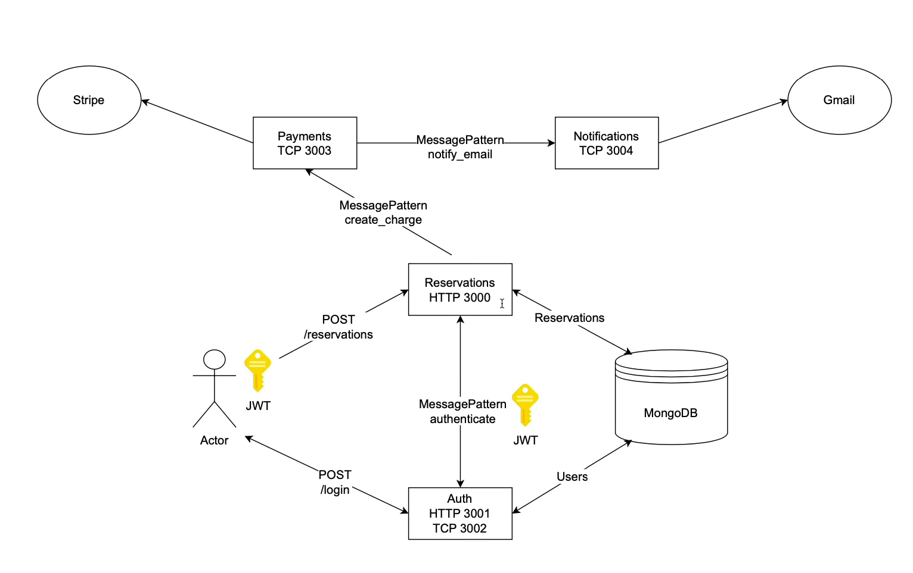

# 🛌 Sleepr Microservices

A scalable microservices-based backend for handling **authentication, reservations, and payments**, built with NestJS and Stripe.

This project is designed to serve as a **backend system** that you can plug into any frontend (web or mobile) to manage bookings and transactions.

---

## 🧠 Overview

This system follows a **microservices architecture**, where each service is responsible for a specific domain:

- **Authentication Service** → Handles user login and JWT authentication  
- **Reservations Service** → Manages booking logic  
- **Payments Service** → Processes payments via Stripe  
- **Notifications Service** → Sends user notifications after successful actions  

Each service communicates internally using **TCP messaging**.

---

## 🔄 How It Works

1. A user logs in via the Authentication Service and receives a JWT  
2. The user sends a request to the Reservations Service to create a booking  
3. The Reservations Service validates the user via the Authentication Service (TCP)  
4. Once verified, it calls the Payments Service  
5. After a successful Stripe payment:
   - The Payments Service triggers the Notifications Service  
   - The user is notified that payment is successful and the reservation is confirmed  

---

## 🏗️ System Architecture

---

## 🚀 API Endpoints

> Replace `your-hosting` with your deployed base URL

**Login**

POST https://your-hosting/login

**Create Reservation**

POST https://your-hosting/reservations

---

## ✨ Features

- 🔐 JWT-based Authentication  
- 🧩 Microservices architecture (NestJS)  
- 💳 Stripe payment integration  
- 📧 Email notifications (Gmail)  
- 🗄️ MongoDB database with TypeORM  
- 🔄 Inter-service communication via TCP  

---

## 🛠️ Tech Stack

- NestJS  
- Stripe API  
- MongoDB  
- TypeORM  
- Node.js  

---

## ⚙️ Installation

### 1. Clone the repository

git clone https://github.com/yourusername/yourrepo.git

cd yourrepo

### 2. Install dependencies

### 3. Configure environment variables

Each microservice has its own `.env` file.

Refer to the `.env.example` files in each service and create corresponding `.env` files.

Example variables:

JWT_SECRET=your_secret
STRIPE_SECRET_KEY=your_key
MONGO_URI=your_mongodb_uri
EMAIL_USER=your_email
EMAIL_PASS=your_password

---

### 4. Run the application

> Ensure all microservices are running concurrently.

---

## 📖 Usage

1. Authenticate a user via `/login`  
2. Use the returned JWT for authorized requests  
3. Create a reservation via `/reservations`  
4. Complete payment through Stripe  
5. Receive confirmation via email notification  

---

## ⚠️ Notes

- This project does **not include a frontend**  
- You are expected to build your own UI and connect it to this backend  
- Ensure all required services are running before making requests  

---

## 🚧 Roadmap

- 🔄 Switch to MySQL with TypeORM   
- 📦 Add end to end tests  
- ☁️ Improve deployment with CI/CD pipelines  

---

## 🤝 Contributing

Contributions, issues, and feature requests are welcome!

---

## 📄 License

MIT